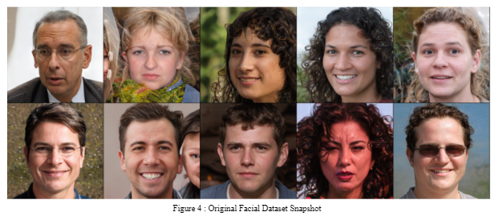
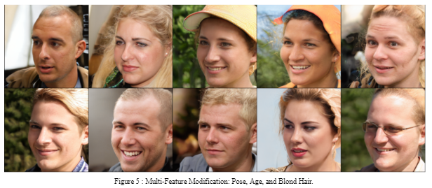
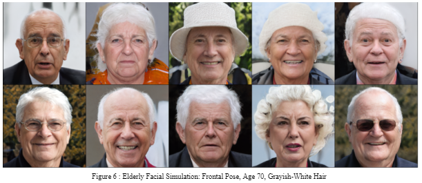
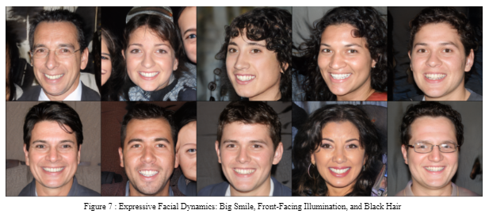

# GAN: Face Generation 

This project focuses on the application of Generative Adversarial Networks (GANs) for facial image generation, divided into two distinct parts. In the first segment, the CelebFaces Attributes Dataset (CelebA) is employed to train adversarial networks, where the generator and discriminator are developed to optimize performance based on training loss. This phase aims to generate high-quality and realistic facial images through effective GAN training. For the second part, the project utilizes a pre-trained model named GAN-Control, specifically designed for fine-tuned control over generated images. Leveraging this model allows for the manipulation of attributes such as age, pose, and expression in the generated faces. This integration empowers the generation of novel faces with precise control over three controllable/disentangling features, marking a significant advancement in the field of facial image synthesis and manipulation.
---

## Exploration

    

Original image, taken directly from the Dataset. Condequently, we made adjustment to the disentangling features to generate different images with their own unique characteristics   

    

In the first sample, our focus honed in on Pose Control, Age Control, and Hair Color manipulation. Pose Control was achieved through Euler angles, where the yaw denoted rotation around the vertical axis, pitch represented rotation around the lateral axis, and roll indicated rotation around the longitudinal axis. Setting specific values for these angles allowed for precise orientation adjustments in the generated faces. Age Control involved a scalar value indicating the age of the person, providing a straightforward means to manipulate the perceived age of the generated faces; in this case, the specified value of 25 years. Additionally, Hair Color was controlled by a set of values in the RGB color space and for this specific sample, the combination of [0.73, 0.62, 0.36] yielded a blond color. The resulting images encapsulate the nuanced adjustments made to the specified features and stored in the 'modified_latent_w'   

    

In the second sample of our exploration, we focused on the task of generating realistic elderly facial images by finely adjusting Pose, Age, and Hair Color parameters. The controlled pose, with values of [0., 0., 0.], ensured a frontal view, presenting the face directly to the viewer. The specified age of 70 years contributed to the generation of facial images portraying an elderly individual, complete with age-related characteristics. Introducing a grayish-white hair color, denoted by the RGB values [0.90, 0.90, 0.90], further enhanced the authenticity of the generated images. Upon applying these precise control parameters to the GAN-Control model, the resulting output images revealed faces that were convincingly looking straight at the viewer, showcasing distinct aging characteristics such as wrinkles, fine lines, and other features associated with an older age. The subtle nuances in the gray hair color added to the realism, collectively highlighting the model's proficiency in simulating and manipulating various age-related features. Essentially, this second sample sought to generate the aged version of the original facial images, exemplifying the model's capability to faithfully capture and simulate the aging process through controlled feature adjustments.   

    

In our exploration's third sample, we introduced additional disentangling features to exert precise control over facial expression and illumination, thereby enhancing the realism and expressiveness of the generated faces. For Facial Expression control, we leveraged a dataset of 1000 expressions stored in a pickle file, experimenting with various indices to capture different facial expressions. In this instance, we selected index 10, resulting in a "Big Smile" expression. To control Illumination, a crucial factor in image realism, we employed a 27-dimensional spherical harmonic vector. By experimenting with combinations in the `sh_eval_basis_1(0, 0, 1)` section, along with adjusting the strength parameter (representing brightness), we achieved a front-facing illumination reminiscent of a flashlight when taking a picture. This added dimension of control over lighting conditions contributed to a heightened sense of realism in the generated facial images. The Color control parameter, similar to previous samples, allowed us to modify hair color. In this example, we opted for black hair, denoted by the RGB values `[0.08, 0.08, 0.08]`. Therefore, the resulting output images exhibited a vivid depiction of the specified facial expression, showcasing a big smile, coupled with a front-facing illumination akin to a camera's flash. The controlled black hair color complemented the overall realistic appearance of the generated faces.    

---

## Website
Web application was created to show the result of various combinations of disentanglement features along with additional features to randomly generate images with five disentanglement features! The application is built using Flask. Please visit the website using ngrok (last cell of the part 2 notebook). 

    

This is the homepage of the demonstration website. It shows one instance of the original image and sample of the generated images using the pre-trained model with the ability to control the features.

    

One of the generated set of images, with the aim of trying to replicate a baby boomer generation)

    

At the top of application homepage, there is a button that allows the user to generate a random pair of original image and generated images with random featurse. The features are randomly generated (five in total)

    

This is the snapshot of one of the image with randomized features

---

## Thank you!
